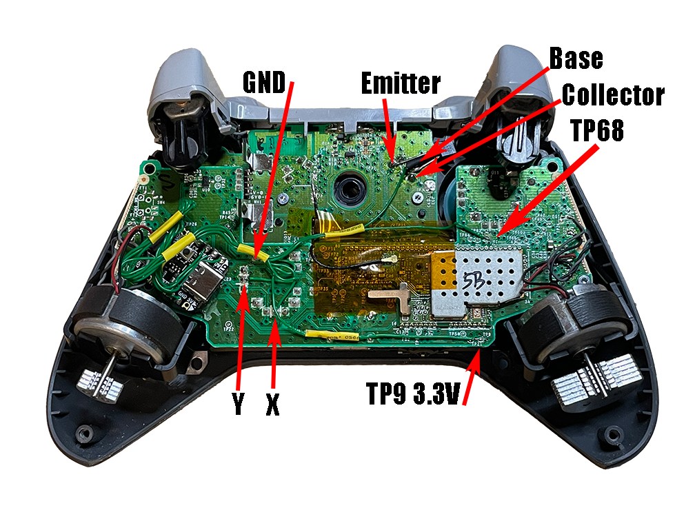

# Xbox Controller Accessibility Mod for Dayton (Wheels)

This project is dedicated to enhancing the gaming experience for Dayton, known in the gaming community as [Wheels](https://twitter.com/WheelsFGC). It involves modifying an Xbox controller to interface with a QT Py RP2040 microcontroller. The modification reads inputs from the controller's analog sticks and manages digital outputs to trigger buttons, making the controller more accessible and comfortable for Wheels to use.

## Features

- Custom interaction with the Xbox controller's right analog stick to intuitively use the Left Bumper (L1) and Left Trigger (L2) buttons.
- A transistor-based circuit to enable the QT Py RP2040 to sink current, necessary for activating the Left Bumper button.

## Components

- Adafruit QT Py RP2040 Microcontroller
- Xbox controller
- Connection wires
- 2N5551 NPN Transistor
- 10k Ohm resistor

## Circuit Diagram/Connections

Below is the schematic represented through ASCII art showing the basic setup:

```
   [Xbox Controller]               [QT Py RP2040]             [2N5551 Transistor]

           3.3V Power (TP9) ----------- VCC
            Right Stick GND ----------- GND -------------------- Emitter
Right Stick Potentiometer X ----------- GPIO A0
Right Stick Potentiometer Y ----------- GPIO A1
 Left Trigger Sensor (TP68) ----------- GPIO A2
                                        GPIO A3 ---- [10kΩ] ---- Base
Left Bumper (Button Signal) ------------------------------------ Collector
```



- The 3.3V power supply (VCC) is taken from TP9 on the controller's PCB.
- The ground connection is established with the ground pin of the right analog stick.
- The X and Y center pins of the right analog stick's potentiometers are connected to the QT Py's GPIO A0 and A1, respectively.
- GPIO A2 is connected to TP68 on the Xbox controller's PCB, used for triggering the Left Trigger (L2).
- For the Left Bumper (L1), GPIO A3 is connected through a 10k ohm resistor to the base of a 2N5551 NPN transistor. The emitter of the transistor is connected to the ground, and the collector is tied to the Left Bumper button's signal line.

## Code Overview

The firmware simply loops over and over checking the Right Ananlog stick's Y-axis position. If pressed up, then it activates Left Trigger at 100% pressed. If pressed, down, then it activates the Left Bumper button.

- The code initializes input and output pins and begins serial communication for debugging purposes.
- In the loop, it reads values from the analog stick, maps these values to a range suitable for game interaction, and prints them to the serial monitor for debugging.
- It checks the Y-position of the stick to decide whether to activate L1 or L2 by manipulating GPIO A2 and A3.

## Building the Project

1. **Controller Preparation:** This involves safely opening the controller, locating points of interest on the PCB, and planning the modification without hindering the controller's original functionality.
2. **Making Connections:** This step requires careful soldering to establish reliable connections between the controller and the QT Py RP2040.
3. **Environment Setup:** Set up the development environment for the QT Py RP2040 with Arduino IDE.
4. **Configuration and Calibration:** Detail any necessary steps for calibrating the analog sticks' inputs, considering their range and sensitivity.

## Challenges and Solutions

One significant challenge was managing the Left Bumper button signal. Initially, the microcontroller couldn't sink the current from the button's signal line. The successful solution was implementing an external pull-down setup using a 2N5551 NPN transistor.

## Future Improvements

This example code can be expanded to trigger on the X-axis or even at diagonal directions. In the future both ananlog sticks could be sniffed and trigger multiple buttons depending on your specific needs.

## Acknowledgments

This project was inspired by and designed for [Dayton "Wheels"](https://twitter.com/WheelsFGC), a prominent figure in the FGC (Fighting Game Community) known for his perseverance and skill, competing at the highest levels despite his physical challenges. This mod aims to make gaming more accessible and enjoyable for him and hopefully others in need of similar solutions.